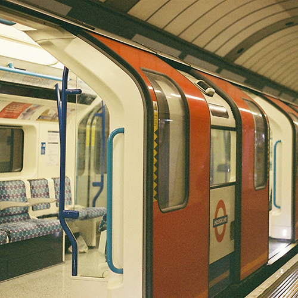
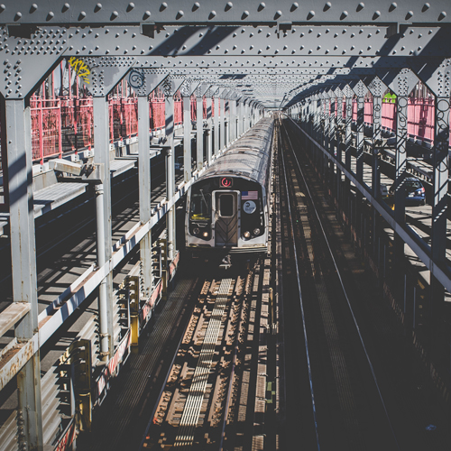

# CSS Reprise

### Introduction

In order to practice what was covered in the CSS Basics and CSS Box Model lessons, let's build out a site together, based on the deliverables below. Open up the `starter-code` provided, and open the `index.html` file in Chrome.

**Desktop**


<br>

**Tablet**


<br>

**Mobile**


> **Note**: We have a `reset.css` file already linked in the head of the `index.html` file.

### Adding HTML markup

Let's add some HTML to our `index.html` to add semantic structure to the page.

```html
<body>
  <header>
    <h1>Instatram</h1>
  </header>
  <main>
    <div class="gallery">
      
      
      
      
      
      
    </div>
    <div class="intro">
      <h2>Sign up too see photos of trains from your friends</h2>
      <p>Lorem ipsum dolor sit amet, consectetur adipisicing elit, sed do eiusmod tempor incididunt ut labore et dolore magna aliqua. Ut enim ad minim veniam, quis nostrud exercitation ullamco laboris nisi ut aliquip ex ea commodo consequat. Duis aute irure dolor in reprehenderit in voluptate velit esse cillum dolore eu fugiat nulla pariatur. Excepteur sint occaecat cupidatat non proident, sunt in culpa qui officia deserunt mollit anim id est laborum.</p>
    </div>
  </main>
  <footer>
    <p>Made with &hearts; at GA London</p>
  </footer>
</body>
```

### Adding a Google font

To start with, let's take a quick look at how to add a Google web font to our site. The font we are going to use is called 'Poppins'. Navigate to the Google fonts website, and search for 'Poppins', then click on "Select this font", then click on the "1 Family Selected" tab at the bottom of the page. Copy and paste the link provided into the `<head>` of the `index.html` file.

```
<link href="https://fonts.googleapis.com/css?family=Poppins:400,700" rel="stylesheet">
```

Google also provides us with the CSS syntax for using this font, so let's copy this and add it to our `style.css`, along with some other default styles for our site.

```css
* {
  box-sizing: border-box;
}

body {
  font-family: 'Poppins', sans-serif;
  line-height: 1.4;
}
```

It's a good idea to set a `line-height` on the body, as the `reset.css` file has set it to be `1`, which is hard to read.

You should see that the font has now changed to a san-serif font.

### Background image

First let's have a look at the header of the website. We're going to use a few new properties here, as well as recapping some that we've already covered.

In `style.css` add the following:

```css
header {
  height: 600px;
  background-image: url('../images/hero.jpg');
  background-size: cover;
  background-position: center;
}
```

By default the header will be 100% of the width of it's parent, and we are going to make it 600px high. We can set a background image by giving it a relative file path. There are a few useful options for `background-size`:

- `contain` - scales the image as large as possible and maintains image aspect ratio (image doesn't get squished). When the image and container have different dimensions, the empty areas (either top/bottom of left/right) are filled with the background-color.
- `cover` - scales the image as large as possible and maintains image aspect ratio (image doesn't get squished). The image "covers" the entire width or height of the container. When the image and container have different dimensions, the image is clipped either left/right or top/bottom.

You can read more about the `background-size` property [here](https://developer.mozilla.org/en/docs/Web/CSS/background-size?v=example). We are using `cover` so that we don't have any white space around the image, no matter what the dimensions are of the header.

### Horizontal & vertical centering 

If we have a look at the deliverables, we can see that the "Instatram" logo sits in the middle of the header horizontally and vertically. Let's use the `position` property to achieve this.

```css
header {
  height: 600px;
  background-image: url('../images/hero.jpg');
  background-size: cover;
  background-position: center;
  position: relative;
}

header h1 {
  position: absolute;
  top: 50%;
  left: 50%;
  transform: translate(-50%, -50%);
  font-size: 45px;
  font-weight: bold;
  color: #fff;
}
```

We want to position the `<h1>` ***in relation*** to the `<header>`, so we need to remember to add `position: relative;` to the `header` styles. We then specify `position: absolute;` for the `h1`. The next few lines are a useful CSS trick that will center the text using percentages, which means that we don't have to do any calculations to work out the center of the `<header>`.

1. First we move the `h1` 50% down from the top of the `header`.
2. Then we move it across `50%` from the left hand side.
3. This means that the top left hand corner of the `<h1>` is now centered inside the header. In order to make the center of the `<h1>` centered instead, we need to move it up 50% of it's own height, and left 50% of it's own height. We can do this using `transform: translate(-50%, -50%);`.

### `:before` & `:after`

We have seen a few examples of `:before` and `:after` elements, but let's have a look at another use case. The design of the site calls for a thick underline underneath the logo. We can't achieve this using `text-decoration: underline`, as we can't control the thickness of the line. We're going to create an `:after` element here, rather than inserting a new div to our HTML, to keep our markup clean.

```css
header h1:after {
  content: "";
  height: 8px;
  background-color: #fff;
  position: absolute;
  bottom: 0;
  left: 0;
  right: 0;
}
```

Let's have a look at what's going on here. We need to add `content: ""`, otherwise the element will not appear at all. We can think of this pseudo element as a little div that we can control using CSS. We are positioning it _absolutely_ underneath the `<h1>`, and using `bottom`, `left` and `right` properties to position it. 

> **Note:** This is also a useful trick if you want to create an underline that is a different color to the text color.


### Creating a centered layout

Let's tackle the layout of the rest of the page. The header should stretch across the whole of the screen, but the content should be centered. We have a `<main>` tag that is wrapping around the content, so let's add some styles to it.

```css
main {
  max-width: 960px;
  margin: 30px auto;
  padding: 0 30px;
  background-color: lightgrey;
}
```

We are adding 30px of margin on the top and bottom, and using `auto` to center it on the page. The padding is preventing the content from sitting flush against the sides of the screen as we resize it, making it more readable. Adding a background color is going to help us visualise where the `<main>` tag is on the screen - we can get rid of this later.

### Adding columns

We want two columns to hold the images on the left, and the text on the right. We added some classes to these earlier, so let's add some styles to them now.

```css
main .gallery {
  width: 50%;
  float: left;
  background-color: pink;
}

main .intro {
  width: 50%;
  float: right;
  padding-left: 30px;
  background-color: blue;
}
```

Again, we are adding background colors so that we can see clearly where the divs are on the page. You should see the grey background of the `<main>` disappearing. This is because the `<main>` now has floated children, so it has collapsed. This isn't an issue yet, but it might be an issue later, so we'll come back to it.

The other thing to notice is that the images are displaying at their original width, and are overflowing their parent container (the `<main>`). We can prevent this from happening by adding the following styles to our CSS:

```css
img {
  max-width: 100%;
}
```

Here we are saying that our images should never be bigger than their parent. This is nice to add, but we don't necessarily need to add this to our code, because of the next step, which is to set the size of the images explicitly. 

We want to create our "gallery" of images. Each image should take up a third of the column, so let's give them a width of `33.33%`.

```css
main .gallery img {
  width: 33.33%;
}
```

Images have a `display` value of `inline` by default, and `inline` elements have a small gap to the right and to the bottom, which isn't desirable for this design. If we add `float: left;` to the image styles, this will remove that gap, and make the images sit flush next to each other.

```css
main .gallery img {
  width: 33.33%;
  float: left;
}
```

Looking good. To finish off the main content, let's add some `h2` styles.

```css
main .intro h2 {
  font-weight: bold;
  margin-bottom: 10px;
  font-size: 24px;
}
```

### Floats

To finish off the desktop version of the site, let's add some footer styles.

```css
footer {
  background-color: #3c3c3c;
  padding: 20px;
  font-size: 12px;
  color: #fff;
  text-align: center;
}
```

Refresh in Chrome. What's happened! Because the `<main>` has floated children, it has collapsed, and the top of the `<footer>` is now where the top of the `<main>` is. We could either add a clearfix class here, or we could use the `overflow: hidden;` hack. 

```css
main {
  max-width: 960px;
  padding: 0 30px;
  margin: 30px auto;
  background-color: lightgrey;
  overflow: hidden;
}
```

We should now see the light grey background reappear. Let's comment this out in the CSS file.

```css
main {
  max-width: 960px;
  padding: 0 30px;
  margin: 30px auto;
  /*background-color: lightgrey;*/
  overflow: hidden;
}
```

This should have sorted out our footer problem, as the main is now taking up the space it needs to contain it's children, and we are also seeing the margin on the bottom that we added earlier. Nice.

### Tablet styles

In order to make our page fully responsive, we don't need to do too much work, because we have been using percentage based widths to create the layout. If you have a look at the tablet deliverable, you will see that the main difference is that the gallery and the text should sit on top of each other, rather than side by side. 

Add the following media query to your CSS.

```css
@media only screen and (max-width: 960px) {
  main .gallery,
  main .intro {
    width: 100%;
  }

  main .intro {
    margin-top: 30px;
    padding: 0;
  }
}
```

Here we are adjusting the width of the `.gallery` and the `.intro` to be 100%, which will override the 50% that we set earlier. We then need to add adjust the margin and padding of the `.intro` styles, so that the text sits flush up against the edge of the `<main>`, and create a gap between the bottom of the images and the top of the text.

### Mobile styles

Finally, let's add a media query for mobile styles. There's only one change that we need to make. We want the gallery of images to be two across instead of three on a mobile.

```css
@media only screen and (max-width: 640px) {
  main .gallery img {
    width: 50%;
  }
}
```

Here we are overriding the 33.33% width that we set earlier, to be 50%, so that each image takes up half of the width of it's parent.